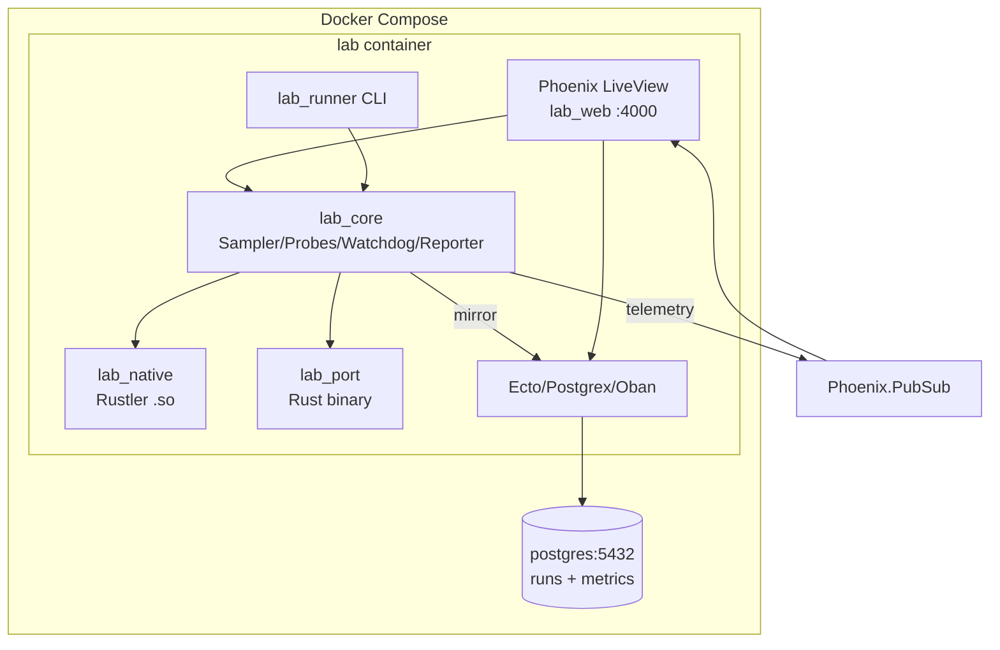
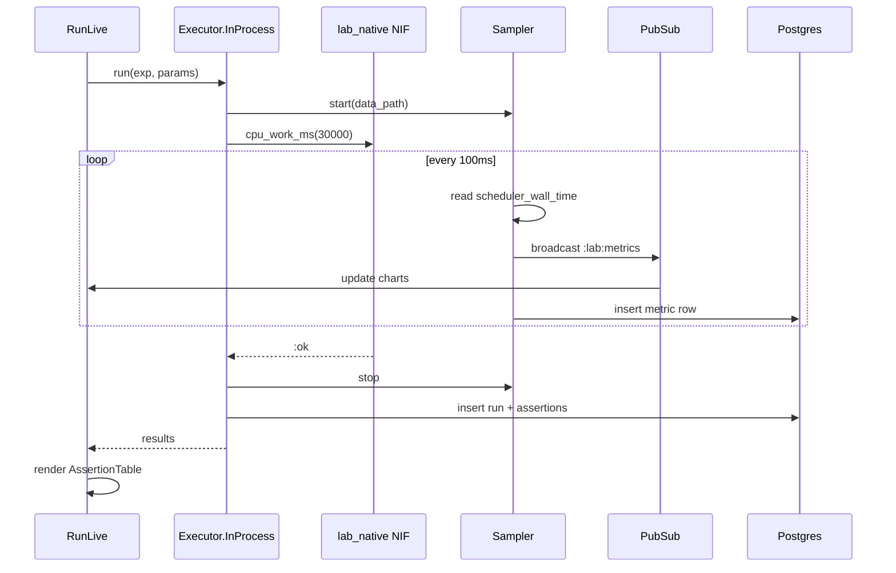
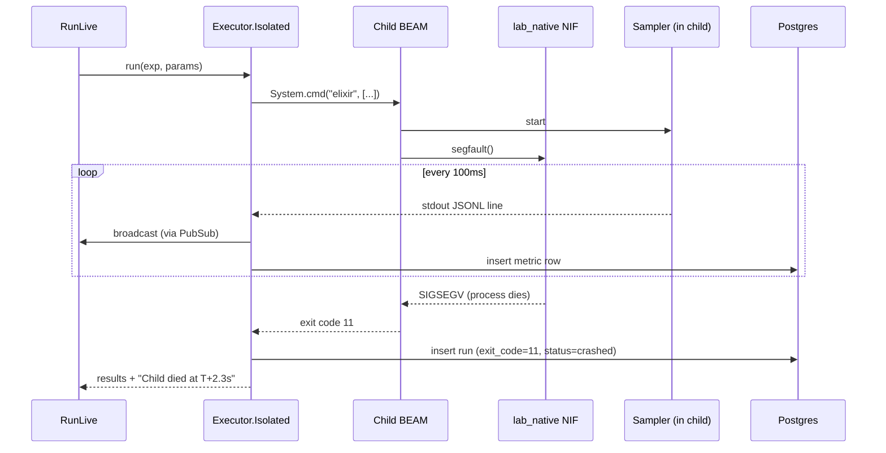
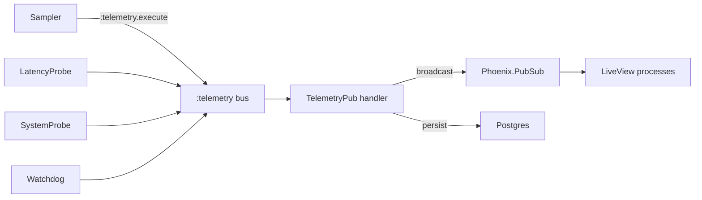
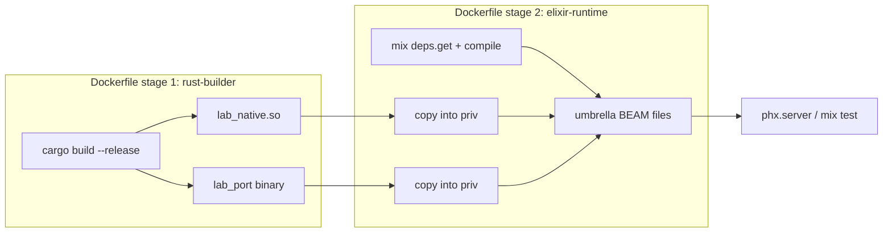

# 09 — Architecture

> System architecture for the BEAM Characterization Lab. Full data flow,
> component responsibilities, protocol specs, and the Postgres schema.

## System diagram



## Component responsibilities

| App | Responsibility | Depends on |
|-----|----------------|------------|
| `lab_core` | Instrumentation: Sampler, LatencyProbe, SystemProbe, Watchdog, Reporter, TelemetryPub | telemetry, Phoenix.PubSub (optional) |
| `lab_native` | Rustler crate: every NIF, Normal + Dirty variants | rustler |
| `lab_port` | Rust binary: stdin/stdout JSON protocol, every port command | serde_json, std::io |
| `lab_web` | Phoenix LiveView control room: dashboard, catalog, run, history, reports, docs | lab_core, lab_native, lab_port, Phoenix, LiveView, Ecto |
| `lab_runner` | CLI for headless/CI experiment execution + test dispatch | lab_core, lab_native, lab_port, Oban, Ecto |

`lab_core` is the foundation — both `lab_web` and `lab_runner` build on it.
`lab_native` and `lab_port` are leaf nodes depended on by `lab_core`'s
experiment executor.

## Data flow during an experiment

### in_process mode



### isolated mode



## lab_port protocol spec

The port binary reads newline-delimited JSON from stdin and writes
newline-delimited JSON to stdout. One request per line; one response per
request.

### Requests

```json
{"cmd": "cpu_work", "ms": 30000, "id": "r1"}
{"cmd": "sleep", "ms": 60000, "id": "r2"}
{"cmd": "segfault", "id": "r3"}
{"cmd": "panic", "id": "r4"}
{"cmd": "leak", "mb": 100, "id": "r5"}
{"cmd": "large_binary", "mb": 100, "id": "r6"}
{"cmd": "pdf_work", "file": "in.pdf", "op": "watermark", "id": "r7"}
{"cmd": "quit"}
```

### Responses

```json
{"id": "r1", "ok": true, "duration_ms": 30001}
{"id": "r3", "ok": false, "error": "segfault"}
```

For `segfault` and `abort`, the process dies before responding — the port
owner sees `{reason, :normal | :terminated}`. That's the crash-isolation
evidence in E17.

### Framing

- One JSON object per line, UTF-8, `\n` terminated.
- Max line length: 1 MB (requests with large inline data aren't supported;
  use a file path instead).
- The port binary is line-buffered on stdout.

## Postgres schema

See [07_ui_architecture.md](07_ui_architecture.md) for the full `runs` and
`metrics` tables. In summary:

- `runs`: one row per experiment execution (id, experiment, params, started,
  ended, exit_code, status, assertions)
- `metrics`: one row per metric sample (run_id, ts, kind, data JSONB)

The UI's History page joins these for side-by-side comparison. JSONL files
are authoritative; Postgres is a mirror for queryability.

## Telemetry pipeline



`TelemetryPub` is attached in `lab_web`'s application start. In `lab_runner`
(headless), a simpler handler writes directly to Postgres + JSONL without
PubSub.

## Build pipeline



Multi-stage build: stage 1 compiles Rust (cargo), stage 2 compiles Elixir
(mix) and copies the Rust artifacts in. Final image runs Phoenix on `:4000`.

## Scheduler flags (pinned everywhere)

```
erl +S 4:4 +SDcpu 4:4 +SDio 4:4 +A 10
```

Set in:
- `docker/entrypoint.sh` for the UI's BEAM
- `Lab.Executor.Isolated` for child BEAMs
- `scripts/run_experiment.sh` for CLI runs
- `.github/workflows/lab.yml` for CI

This ensures E01's "blocks 1 of 4 schedulers" means the same thing in every
context.

## Directory ownership

| Path | Owned by | Edited by experiments? |
|------|----------|------------------------|
| `umbrella/apps/lab_core/` | lab_core maintainers | No (experiments use it) |
| `umbrella/apps/lab_native/` | lab_native maintainers | **Yes** — experiments add NIFs here |
| `umbrella/apps/lab_port/` | lab_port maintainers | **Yes** — experiments add port commands here |
| `umbrella/apps/lab_web/` | lab_web maintainers | No (experiments are browsed, not coded) |
| `experiments/E##_*/` | the experiment's commit | **Yes** — one dir per experiment |

When an experiment needs a new NIF, it adds it to `lab_native/native/src/`
in the same commit. Same for port commands in `lab_port/src/`. This keeps
the native boundary in one auditable place (ADR 0001).
